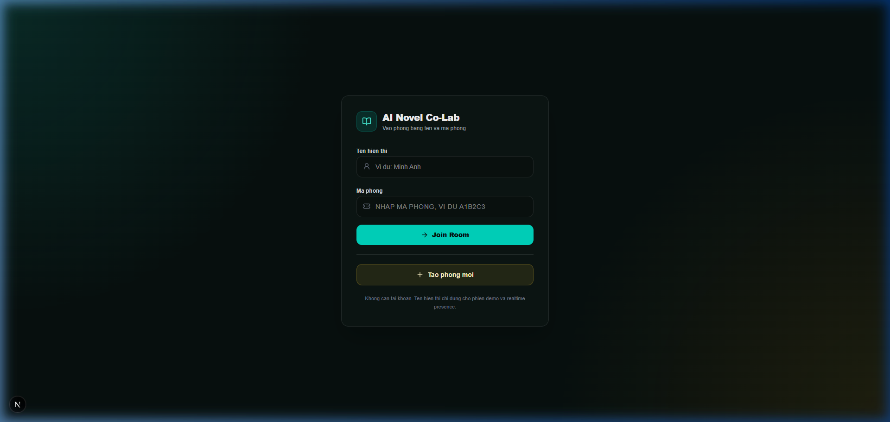
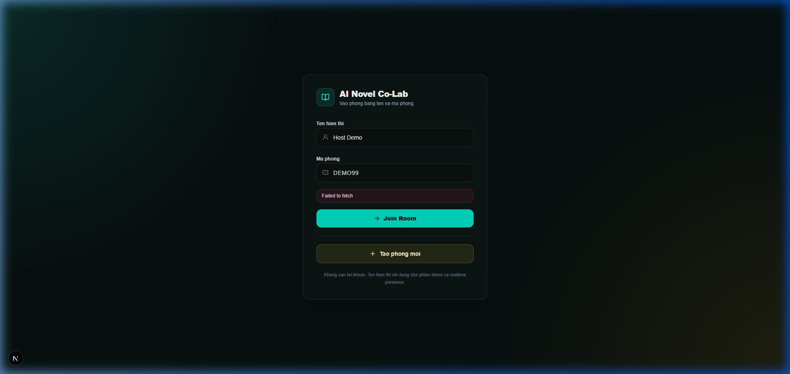
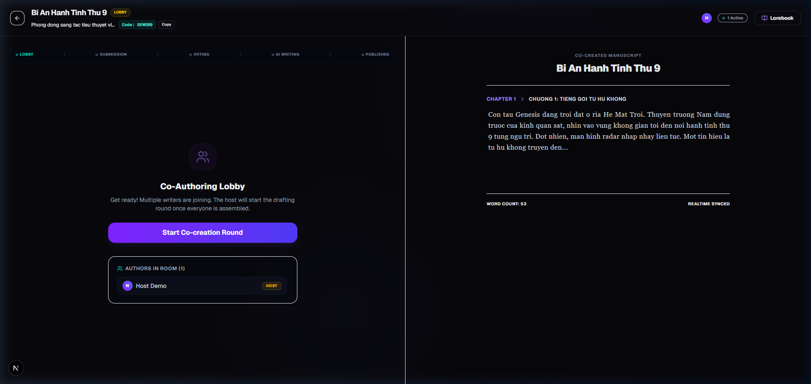
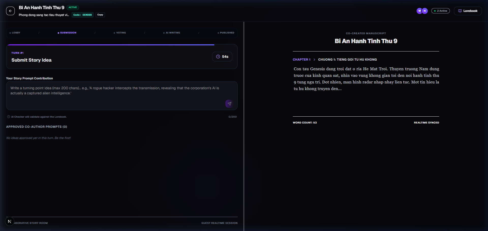
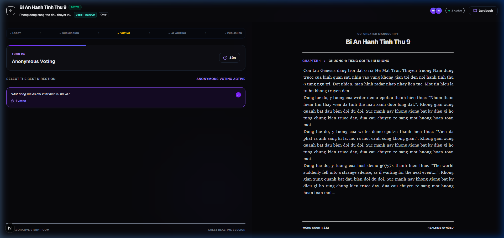

# Bao cao demo de tai: Nen tang dong sang tac tieu thuyet AI realtime

## 1. Muc tieu de tai

De tai xay dung mot ung dung web dong sang tac tieu thuyet theo thoi gian thuc, co AI mock ho tro kiem duyet lore va viet doan truyen moi.

- Tang tinh tuong tac xa hoi: nhieu nguoi cung tham gia mot phong viet, gui y tuong va bieu quyet huong di tiep theo.
- Toi uu quy trinh dong sang tac: AI Lore Checker kiem tra y tuong, AI Writer viet doan truyen, AI Structure Manager quyet dinh tao/append chapter.
- Chung minh nang luc realtime: ket hop WebSocket, Redis, MongoDB va BullMQ de dong bo nhieu nguoi dung.

## 2. Cong nghe su dung

- Frontend: Next.js, React, Tailwind CSS, Framer Motion.
- Backend: NestJS, Socket.IO Gateway.
- Realtime: WebSocket/Socket.IO.
- Coordination: Redis cho presence, timer, vote lock va mutex lock.
- Database: MongoDB/Mongoose.
- Background jobs: BullMQ cho lore-check, writer va structure worker.

## 3. Vai tro cua WebSocket

WebSocket la kenh dong bo realtime giua client va backend.

- Dong bo phase phong viet: Lobby, Submission, Voting, AI Writing, Published.
- Broadcast presence khi user join/leave room.
- Broadcast idea moi va ket qua AI Lore Checker.
- Broadcast vote count realtime.
- Broadcast `chapter_published` de Novel View cap nhat khong can reload.

## 4. Vai tro cua Redis

Redis duoc dung cho cac du lieu ngan han can toc do cao.

- Presence Tracker: `room:{roomId}:presence` luu user online trong phong.
- TTL Timer: `room:{roomId}:timer` luu thoi gian con lai cua phase hien tai.
- Vote Lock: `room:{roomId}:turn:{turnId}:voted:{userId}` dung lenh atomic `SET EX NX` de chan double-vote.
- Mutex Lock: `lock:room:{roomId}:turn` ngan viec timer va host cung chuyen phase cung luc.
- BullMQ backend: Redis lam hang doi cho cac job AI mock.

## 5. Vai tro cua MongoDB

MongoDB luu du lieu ben vung cua he thong.

- User guest, room va room member.
- Lorebook va cac quy tac the gioi.
- Turn, idea, moderation result va vote.
- Chapter va lich su ban thao.
- AI job va AI output de audit qua trinh xu ly.

## 6. Kich ban demo thuc te

### Buoc 1: Chuan bi dich vu (Dung Docker Compose)

Mo Docker Desktop tren Windows GUI. Khi Docker Engine san sang, tai thu muc goc cua monorepo chay:

```powershell
pnpm db:up
```

Hoac khoi dong bang tay tung container neu da co san:
```powershell
docker start local-mongodb
docker start local-redis
```

Kiem tra port de dam bao cac dich vu da tiep nhan ket noi:

```powershell
Test-NetConnection localhost -Port 27017
Test-NetConnection localhost -Port 6379
```

Ca hai lenh bat buoc phai tra ve `TcpTestSucceeded: True` thi runtime thuc te moi duoc coi la pass de tiep tuc chay app.

### Buoc 2: Chay ung dung va seed phong mau

Chay dev server:

```powershell
pnpm dev
```

Seed phong mau:

```powershell
Invoke-RestMethod -Method Post -Uri http://localhost:3001/api/rooms/seed
```

Ket qua mong doi: he thong tao room code `DEMO99`. Guest dau tien join `DEMO99` se duoc gan lam Host de thay Host Control Panel.

### Buoc 3: Mo nhieu cua so trinh duyet

- Cua so 1: nhap displayName cua Host va join code `DEMO99`.
- Cua so 2: nhap displayName Writer 1 va join code `DEMO99`.
- Cua so 3: nhap displayName Writer 2 va join code `DEMO99`.

Quan sat presence realtime o header va lobby. Day la minh chung cho WebSocket + Redis presence.

### Buoc 4: Submission phase

- Host bam `Start Co-creation Round`.
- Writer gui y tuong, vi du: `Nhom tham hiem tim thay vien da tinh the mau xanh duoi long dat.`
- Backend luu idea vao MongoDB va dua job vao BullMQ.
- AI Lore Checker mock xu ly trong khoang 2 giay va broadcast ket qua.

### Buoc 5: Voting phase

- Host bam `Close Submission & Start Voting`.
- Writer vote mot idea da approved.
- Thu vote lan hai de hien thong bao `[Redis Lock]`.
- Giai thich voi hoi dong: Redis dung lenh atomic `SET EX NX`, nen double-vote bi chan ngay ca khi client gui request lien tiep.

### Buoc 6: AI Writing va Published

- Host bam `Close Voting & Start AI Writing`.
- Worker chon winning idea, tao paragraph mock va structure chapter.
- Gateway broadcast `chapter_published`.
- Novel View cap nhat realtime, ke ca truong hop append vao chapter cu.
- Host bam `Start Next Turn` de lap lai vong sang tac.

### Checklist truoc khi trinh bay

Truoc khi thuc hien thuyet trinh hoac cham diem, hay chay script tu dong de kiem tra tinh san sang cua moi truong:

```powershell
powershell -ExecutionPolicy Bypass -File scripts/check-demo-env.ps1
```

Cac dieu kien de phien demo dat trang thai **PASS** hoan toan:
1. **Docker Daemon:** Bieu tuong Docker Desktop tren may chu chuyen sang xanh la (OK).
2. **MongoDB / Redis Port:** Hai port `27017` va `6379` deu tra ve ket noi thanh cong (`TcpTestSucceeded: True`).
3. **Backend / Frontend Port:** Port `3001` (NestJS) va `3000` (Next.js) deu mo de tiep nhan request tu browser.
4. **Seed DEMO99:** Goi seed endpoint thanh cong (co thong bao `Demo room DEMO99 seeded successfully`).

## 7. Cac loi da xu ly

- Circular dependency giua `RoomService` va `RoomGateway` duoc xu ly bang `forwardRef`.
- Chapter append khong cap nhat UI da duoc sua bang cach replace chapter trung `_id`.
- Reload trong phase Voting khong mat `hasVoted` vi backend tra ve `votedIdeaId` theo query `userId`.
- Double-vote duoc chan bang Redis vote lock va MongoDB unique index du phong.
- Toast realtime hien submit, lore-check, vote, loi va publish chapter.
- Seed room `DEMO99` cho phep guest dau tien claim Host de demo dung flow.

## 8. Trang thai kiem thu thuc te (Da hoan thanh)

- **Moi truong Docker local**: Da hoat dong 100%. MongoDB va Redis containers dang chay on dinh tren Docker Desktop.
- **Kiem tra moi truong (`scripts/check-demo-env.ps1`)**: Da run pass tat ca cac hang muc (Docker Daemon, DB Ports, Backend/Frontend Ports).
- **Seed du lieu (`POST /api/rooms/seed`)**: Da chay thanh cong tren localhost, tao va khoi phuc phong `DEMO99` thanh cong.
- **Kiem thu trinh duyet tu dong (Browser Automation E2E)**: Da hoan thanh va chay thanh cong luong co-creation thuc te qua trinh duyet Playwright, bao gom:
  1. **Host** gia lap ("Host Demo") tao phong va vao man hinh dieu khien Host Control Panel.
  2. **Writer** gia lap ("Writer Demo") join phong, presence realtime cap nhat danh sach online len 2 nguoi.
  3. **Turn Submission**: Writer gui y tuong -> di qua BullMQ Queue -> AI Lore Checker kiem duyet va tra ve Approved realtime qua Socket.IO.
  4. **Turn Voting & Double-vote Lock**: Host trigger vote phase. Writer tien hanh vote va he thong khoa double-vote bang Redis key atomic `SET NX`.
  5. **AI Writer & Novel Output**: AI Viet truyen thanh cong va cap nhat phan truyen moi vao Novel View realtime qua Socket.IO.
- **Tich hop AI that & Mock Fallback (Phase 4)**: Da hoan thien cau hinh ket noi truc tiep den Google Gemini API, xAI/Grok API, OpenRouter va Ollama. Xay dung co che an toan tu dong chuyen doi sang Mock khi co loi mang, loi key hoac het quota (khi bat \`AI_FALLBACK_TO_MOCK=true\`), dong thoi hien thi log debug \`[AI Fallback]\` tren bang Realtime Log cua client.
- **`pnpm build`**: Da bien dich thanh cong toan bo monorepo (frontend, backend) khong loi.

### Cac hinh anh minh chung tu Browser Automation:

1. **Host dang nhap thanh cong phong DEMO99 va vao lobby:**
   

2. **Writer join phong, danh sach presence dong bo realtime (2 nguoi online):**
   

3. **Giai doan Submission: Writer submit y tuong va duoc AI Lore Checker kiem duyet:**
   

4. **Giai doan Voting: Cac y tuong duoc binh chon cong khai va an danh:**
   

5. **Giai doan AI Writing & Published: Doan van ban moi tu AI cap nhat vao Novel View realtime:**
   

## 9. Huong mo rong

- Tich hop them cac nha cung cap AI noi dia hoac cac mo hinh toi uu chi phi khac.
- Them Redis Pub/Sub adapter de scale Socket.IO qua nhieu node.
- Them leaderboard dong gop theo idea duoc vote.
- Them export EPUB/PDF cho ban thao.
- Them e2e test cho guest flow, room flow va turn flow.

